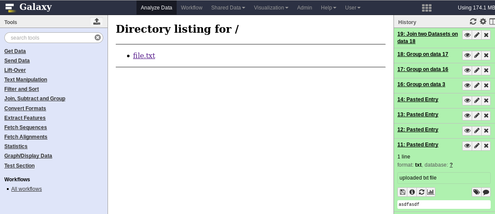

Hello, World Interactive Environment
====================================

"Hello, World" for building IEs

Usage
=====

* Build your own image and run it

 [Docker](https://www.docker.com) is a pre-requirement for this project. You can build the container with:
 ```bash
 $ docker build -t hello-ie .
 ```
 The build process can take some time, but if finished you can run your container with:

 ```bash
 $ docker run -it hello-ie
 ```
* Next, follow the [directions](galaxy-conf/README.md) in the `./galaxy-conf/`
  folder to get the HelloWorld IE installed
* Ensure that the dynamic proxy is available:

  ```bash
  $ cd $GALAXY_ROOT/lib/galaxy/web/proxy/js
  $ npm install .
  ```
* Set the following configuration options in your `$GALAXY_ROOT/config/galaxy.ini` file:

  ```ini
  dynamic_proxy_manage=True
  dynamic_proxy_session_map=database/session_map.sqlite
  # Pick a free port here
  dynamic_proxy_bind_port=8800
  dynamic_proxy_bind_ip=0.0.0.0
  # Enable verbose debugging of Galaxy-managed dynamic proxy.
  dynamic_proxy_debug=True
  ```
  
  Also make sure that:
  
  ```ini
  interactive_environment_plugins_directory = config/plugins/interactive_environments
  ```
  
  is set in the same file, pointing to the directory where you IEs are. Otherwise the IEs won't be loaded.
  
* At this point you should be able to launch Galaxy, upload a text dataset,
  and click "Visualize" and "HelloWorld"
* Galaxy will launch the Interactive Environment in the background. As you can
  see the container was launched with this command built for you:

  ```console
    $ docker run --sig-proxy=true \
        -d -P \
        -e "API_KEY=1712364174a0ff79b34e9a78fee3ca1c" \
        -e "CORS_ORIGIN=http://localhost" \
        -e "CUSTOM=42" \
        -e "DEBUG=false" \
        -e "GALAXY_PASTER_PORT=8000" \
        -e "GALAXY_URL=http://localhost/galaxy/" \
        -e "GALAXY_WEB_PORT=8000" \
        -e "HISTORY_ID=f2db41e1fa331b3e" \
        -e "PROXY_PREFIX=/galaxy/gie_proxy" \
        -e "REMOTE_HOST=127.0.0.1" \
        -e "USER_EMAIL=hxr@local.host" \
        -v "/tmp:/import/" \
        -v "./README.md:/import/file.dat:ro" \
      hello-ie
  ```
* In the UI the container should load (with a nice spinner) and then you should see this image:
  

  where file.txt contains the content of the file which was mounted through the /import/

Environment Variables
=====================

Several environment variables are available by default, per IE rough standards

Variable            | Use
------------------- | ---
`API_KEY`           | Galaxy API Key with which to interface with Galaxy
`CORS_ORIGIN`       | If the notebook is proxied, this is the URL the end-user will see when trying to access a notebook
`DEBUG`             | Enable debugging mode, mostly for developers
`PROXY_PREFIX`      | Used in Galaxy Interactive Environments to ensure that the GIE is under the same cookie path as Galaxy.
`GALAXY_URL`        | URL at which Galaxy is accessible
`GALAXY_WEB_PORT`   | Port on which Galaxy is running, if applicable
`HISTORY_ID`        | ID of current Galaxy History, used in easing the dataset upload/download process
`NOTEBOOK_PASSWORD` | Password with which to secure the RStudio login. The default username is `galaxy`
`REMOTE_HOST`       | Unused


Authors
=======

 * Bjoern Gruening
 * Helena Rasche

History
=======

- v0.1: Initial public release
- v0.2: Updated to 15.10 standards
